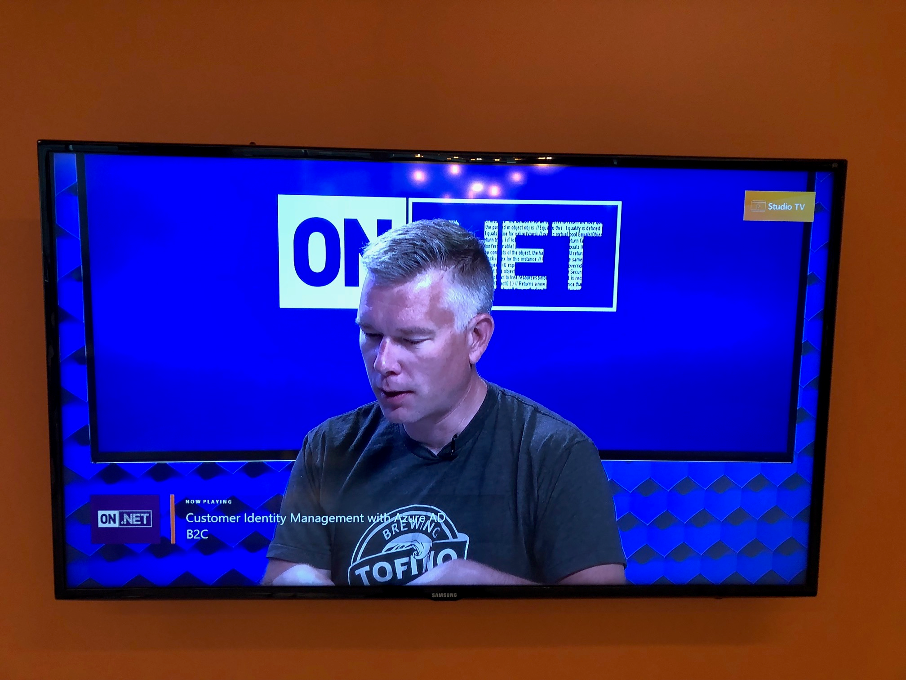
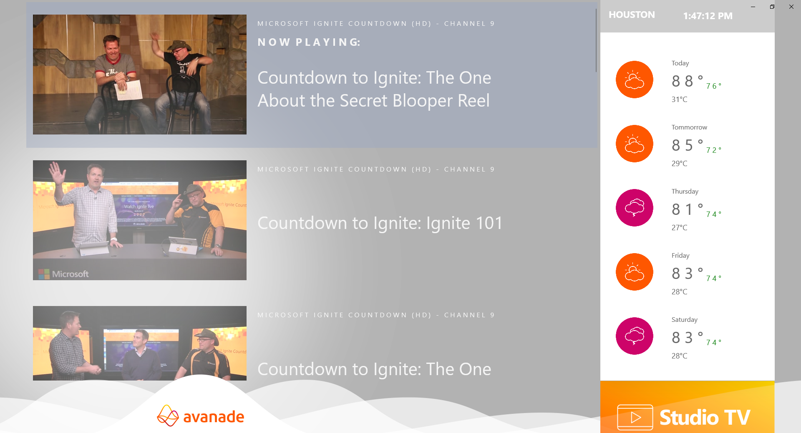

# Avanade-StudioTV ![logo]
Multi-platform player for continuous Channel 9 content streaming to Windows, Android and IOS devices.
(/Avanade-StudioTV/DesignAssets/studio.png)
 This is an open source RSS Feed player customized to play RSS Content from Microsoft's Channel 9 Network. This project uses Xamarin.Forms to create a player that will show a Feed of Channel 9 shows on a large screen TV (And in the future, on Mobile devices like iPads and Android Tablets)

 
 
    
